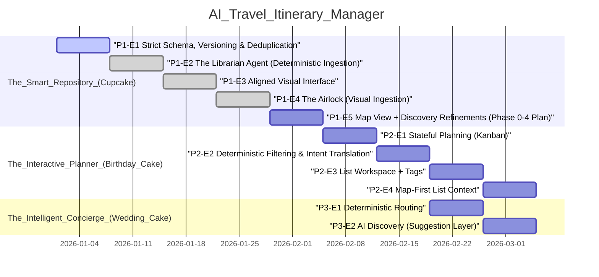

## Agent Quickstart
- Read `AGENTS.md` and `docs/VIBE_PLAYBOOK.md` before making changes.
- Invariants: DB is source of truth; only approved pins are truth; enrich once, read forever; strict taxonomy; user edits never overwrite frozen AI enrichment.
- DoD: tests updated/added; verification steps; migrations + `npm run db:types` if schema changed; no TODO placeholders in Decisions / Rationale or Next Steps.
- Pointers: `roadmap.json` for phases, `supabase/migrations` for schema, `docs/reports` for learning reports.
- Phase 2 plan: `docs/PHASE_2_PLAN.md`.
- Starting a new task/chat? Use `prompts/agent_task.md`.

## 🧠 Active Context
- Current Phase: The Interactive Planner (Birthday Cake)
- Active Epic: P2-E3 List Workspace + Tags
- Immediate Blocker: None. Place detail + map-first membership edits are in place; place drawer now supports list toggles.
- Planned (Phase 2): P2-E3 List Workspace + Tags (per-place tags + multi-list add/remove).
- Planned (Phase 2): P2-E4 Map-First List Context (drawer overlay, URL-driven place drawer, search bias, default view).

## 🗺️ Roadmap Visualization

## 📜 The Constitution
- LLMs label and translate intent; deterministic systems retrieve and compute.
- Only approved pins are truth (Map is the interface).
- Enrich Once, Read Forever (Frozen by default, versioned if refreshed).
- Strict Taxonomy: AI outputs must match UI Icon sets exactly.
- User edits never overwrite frozen AI enrichment.

## 📝 Implementation Memory
- 2026-01-29 – feat: map-first place drawer membership edits
    Added a map drawer for selected places with list membership toggles and a lightweight place summary.
- 2026-01-29 – feat: place detail list membership editor
    Added list membership toggles for places, using idempotent add/remove list item routes.
- 2026-01-29 – feat: list workspace tags + filters
    Added list-scoped tag normalization utilities, tag editing + membership endpoints, and list detail/drawer filters with inline tag editing.
- 2026-01-29 – plan: map-first drawers + multi-list membership semantics
    Added add/remove list membership, URL-driven place drawer, and overlay layering to Phase 2 plan.
- 2026-01-29 – roadmap: add map-first list context to Phase 2
    Added a Phase 2 epic for the list drawer overlay, map-biased search, and default view policy.
- 2026-01-28 – roadmap: add list detail view + tags to Phase 2
    Added Phase 2 epic P2-E3 for a list detail view with per-place tags and list-scoped tag filters.
- 2026-01-27 – feat: add lists link to map
    Added a lightweight "Lists" link under the Omnibox for discoverable list management.
- 2026-01-27 – chore: regenerate supabase types
    Regenerated types after the promote_place_candidate RPC added optional list assignment.
- 2026-01-27 – feat: add places_view and map viewport persistence
    Added places_view migration with computed lat/lng, updated MapContainer to read from the view, regenerated types, and implemented fitBounds/load persistence + approval flyTo behavior.
- 2026-01-27 – chore: refine phase 2 planning + timezone strategy
    Auto-generated from git log (c0e7c86).
- 2026-01-27 – clean up extensions and supabase docs
    Auto-generated from git log (f5bef29).
