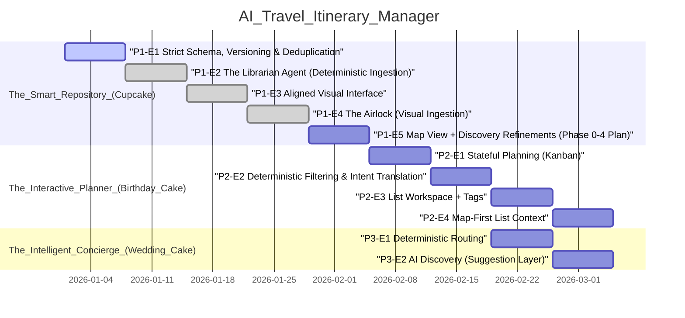

## Agent Quickstart
- Read `AGENTS.md` and `docs/VIBE_PLAYBOOK.md` before making changes.
- Invariants: DB is source of truth; only approved pins are truth; enrich once, read forever; strict taxonomy; user edits never overwrite frozen AI enrichment.
- DoD: tests updated/added; verification steps; migrations + `npm run db:types` if schema changed; no TODO placeholders in Decisions / Rationale or Next Steps.
- Pointers: `roadmap.json` for phases, `supabase/migrations` for schema, `docs/reports` for learning reports.
- Phase 2 plan: `docs/PHASE_2_PLAN.md`.
- Starting a new task/chat? Use `prompts/agent_task.md`.

## 🧠 Active Context
- Current Phase: The Interactive Planner (Birthday Cake)
- Active Epic: P2-E4 Map-First List Context (UI/UX polish)
- Immediate Blocker: None. Next slice: NYC transit overlay (GeoJSON runtime layers), then optional PMTiles wiring + MapLibre style refinement.
- Planned (Phase 2): P2-E3 List Workspace + Tags (per-place tags + multi-list add/remove).
- Planned (Phase 2): P2-E4 Map-First List Context (drawer overlay, URL-driven place drawer, search bias, default view).

## ✅ P2-E4 Remaining Plan (Tracking)
- [x] Decide URL contract: `/?place=<id>` map drawer deep link; keep `/places/[id]` full detail page.
- [x] Decide history semantics: URL open/close should create history entries so Back/Forward toggles drawer state.
- [x] Implement URL-driven drawer state in `components/map/MapContainer.tsx` (read/write `?place=`, close clears param, handle missing id by clearing param after load).
- [x] Convert every open/close path to URL (map click clears param + discovery, marker click sets param with propagation guard intact, PlaceDrawer close clears param, ListDrawer onPlaceSelect sets param).
- [x] Replace map-away navigation (Inspector approve + list detail selection) with map-shell `/?place=<id>`.
- [x] Preserve deep links through sign-in (include search params in `next`).
- [x] Add/extend Playwright tests for URL open/close + back/forward + marker click updates URL.
- [x] MapLibre feasibility note (token gating + mapbox entrypoint implications) captured in docs or roadmap.

## 🧭 MapLibre Feasibility Plan (Tracking)
- [x] Add provider flag (`NEXT_PUBLIC_MAP_PROVIDER=mapbox|maplibre`) and make token gating provider-aware.
- [x] Split renderers: `MapView.mapbox.tsx` / `MapView.maplibre.tsx` with `forwardRef` to preserve `mapRef`.
- [x] Move all Marker rendering (including GhostMarker) into the renderer to avoid mixed providers.
- [x] Make bounds + radius calculations provider-agnostic (remove `LngLatBounds` + `distanceTo`).
- [x] Add minimal MapLibre style JSON and wire the MapLibre renderer.
- [ ] Optional: PMTiles protocol wiring + pmtiles style JSON for staged assets.
- [x] Document optional MapLibre Playwright run in `docs/PLAYWRIGHT.md`.

## 🧭 Map Customization (Tracking)
- [x] Transit overlay (NYC): add GeoJSON assets under `public/map/overlays/` (lines + optional stations).
- [x] Add right-overlay "Layers" toggle (pointer-events-auto) and accept drawer offset shift.
- [x] Render transit overlays in `MapView.*` (non-interactive layers, lazy-load/cached).
- [x] E2E: transit enabled does not block marker click → place drawer opens.
- [ ] Map style selection: dark map style for Mapbox + MapLibre (map-only).
- [ ] Neighborhood boundaries: NYC GeoJSON overlay (runtime layer).

## 🗺️ Roadmap Visualization

## 📜 The Constitution
- LLMs label and translate intent; deterministic systems retrieve and compute.
- Only approved pins are truth (Map is the interface).
- Enrich Once, Read Forever (Frozen by default, versioned if refreshed).
- Strict Taxonomy: AI outputs must match UI Icon sets exactly.
- User edits never overwrite frozen AI enrichment.

## 📝 Implementation Memory
- 2026-02-02 – feat: place type + tag filters + helper copy
    Added separate place type and tag chip groups in list views (types drive icons), with OR-within/AND-across filtering and clarified copy for type vs tags.
- 2026-02-02 – feat: map/list linking + focused glow
    Clicking a map pin focuses the list row, opens the place drawer, and both surfaces share a subtle glow outline; list row clicks pan to map and open the drawer.
- 2026-02-02 – test: list filters + map linking e2e coverage
    Added Playwright coverage for list tag filtering and map marker → list focus + place drawer behavior.
- 2026-02-02 – chore: stage MapLibre pmtiles assets
    Added pmtiles assets under public/map to support future MapLibre map style experiments.
- 2026-02-02 – plan: slate glass overlays + dockable windows
    Tracking the UI/UX sprint: apply the Slate/Stone/Ice glass system to map overlays first, then add minimize/dock chrome and drag later while preserving overlay offset invariants.
- 2026-01-30 – test: add deterministic seed API for Playwright
    Added a guarded /api/test/seed endpoint and seed helper to create lists + places for E2E tests, removing conditional skips.
- 2026-01-30 – test: add Playwright e2e smoke coverage
    Added Playwright config + smoke specs for map place drawer behavior, plus docs and ignore rules.
- 2026-01-30 – fix: place drawer tag editing + overlay stacking
    Added editable list tags inside the map place drawer, refreshed drawer state on membership changes, and pushed the drawer below the inspector while keeping it visible.
- 2026-01-30 – fix: place drawer tags + list search parity
    Added tag visibility in the map place drawer, switched list detail search to Google Places ingest + promote flow, and raised the inspector layer above the list-driven place drawer.
- 2026-01-29 – fix: list navigation + map click + place tag chips
    Linked list titles to list pages, fixed map pin click propagation, expanded local search matching, and updated place user tags to chip-style editing with header display.
- 2026-01-29 – fix: list search + tag chip UX + map shell polish
    Switched list local-search to keywords with deterministic ordering + category match, moved Omnibox results into a portal to avoid drawer clipping, added chip-based tag editing with clear-all persistence, stabilized map camera on empty list selection, and added sign-out in the map shell.
- 2026-01-29 – plan: P2-E3 tag chip UX + local search fix + map overlays
    Planned local-search contract + tag chip UX with clear-all, map camera guardrails, Omnibox portal layering, and sign-out placement.
- 2026-01-29 – feat: list add flows + wiki gating
    Added map drawer list creation, list view local search + add with tags, add-time tag seeding on list membership, and Sights-only wiki summaries.
- 2026-01-29 – plan: P2-E3 add flow + tag seeding + wiki gating
    Planned list creation in map drawer, list view local search + add with tags, add-time enrichment tag seeding, and Sights-only wiki summaries.
- 2026-01-29 – feat: map-first place drawer membership edits
    Added a map drawer for selected places with list membership toggles and a lightweight place summary.
- 2026-01-29 – feat: place detail list membership editor
    Added list membership toggles for places, using idempotent add/remove list item routes.
- 2026-01-29 – feat: list workspace tags + filters
    Added list-scoped tag normalization utilities, tag editing + membership endpoints, and list detail/drawer filters with inline tag editing.
- 2026-01-29 – plan: map-first drawers + multi-list membership semantics
    Added add/remove list membership, URL-driven place drawer, and overlay layering to Phase 2 plan.
- 2026-01-29 – roadmap: add map-first list context to Phase 2
    Added a Phase 2 epic for the list drawer overlay, map-biased search, and default view policy.
- 2026-01-28 – roadmap: add list detail view + tags to Phase 2
    Added Phase 2 epic P2-E3 for a list detail view with per-place tags and list-scoped tag filters.
- 2026-01-27 – feat: add lists link to map
    Added a lightweight "Lists" link under the Omnibox for discoverable list management.
- 2026-01-27 – chore: regenerate supabase types
    Regenerated types after the promote_place_candidate RPC added optional list assignment.
- 2026-01-27 – feat: add places_view and map viewport persistence
    Added places_view migration with computed lat/lng, updated MapContainer to read from the view, regenerated types, and implemented fitBounds/load persistence + approval flyTo behavior.
- 2026-01-27 – chore: refine phase 2 planning + timezone strategy
    Auto-generated from git log (c0e7c86).
- 2026-01-27 – clean up extensions and supabase docs
    Auto-generated from git log (f5bef29).
