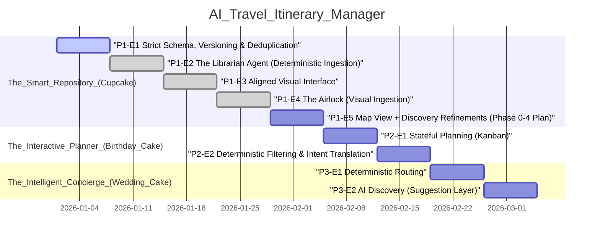

## Agent Quickstart
- Read `AGENTS.md` and `docs/VIBE_PLAYBOOK.md` before making changes.
- Invariants: DB is source of truth; only approved pins are truth; enrich once, read forever; strict taxonomy; user edits never overwrite frozen AI enrichment.
- DoD: tests updated/added; verification steps; migrations + `npm run db:types` if schema changed; no TODO placeholders in Decisions / Rationale or Next Steps.
- Pointers: `roadmap.json` for phases, `supabase/migrations` for schema, `docs/reports` for learning reports.

## 🧠 Active Context
- Current Phase: The Smart Repository (Cupcake)
- Active Epic: Strict Schema, Versioning & Deduplication
- Immediate Blocker: Task 1.4 – Generate Supabase DB Types.

## 🗺️ Roadmap Visualization

## 📜 The Constitution
- LLMs label and translate intent; deterministic systems retrieve and compute.
- Only approved pins are truth (Map is the interface).
- Enrich Once, Read Forever (Frozen by default, versioned if refreshed).
- Strict Taxonomy: AI outputs must match UI Icon sets exactly.
- User edits never overwrite frozen AI enrichment.

## 📝 Implementation Memory
- 2026-01-27 – 🚧 CURRENT SESSION – Implement places_view + viewport persistence
    Added places_view migration with computed lat/lng, updated MapContainer to read from the view, regenerated types, and implemented fitBounds/load persistence + approval flyTo behavior.
- 2026-01-27 – chore: refine phase 2 planning + timezone strategy
    Auto-generated from git log (c0e7c86).
- 2026-01-27 – clean up extensions and supabase docs
    Auto-generated from git log (f5bef29).
