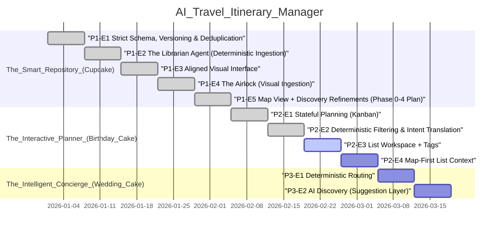

## Agent Quickstart
- Read `AGENTS.md` and `docs/VIBE_PLAYBOOK.md` before making changes.
- Invariants: DB is source of truth; only approved pins are truth; enrich once, read forever; strict taxonomy; user edits never overwrite frozen AI enrichment.
- DoD: tests updated/added; verification steps; migrations + `npm run db:types` if schema changed; no TODO placeholders in Decisions / Rationale or Next Steps.
- Pointers: `roadmap.json` for phases, `supabase/migrations` for schema, `docs/reports` for learning reports.
- Phase 2 plan: `docs/PHASE_2_PLAN.md`.
- Starting a new task/chat? Use `prompts/agent_task.md`.

## 🧠 Active Context
- Current Phase: The Interactive Planner (Birthday Cake)
- Active Epic: Deterministic Filtering & Intent Translation (stabilization)
- Immediate Blocker: None. Seeded Playwright desktop DnD scheduling/reorder/Done/Backlog persistence coverage is restored in the 12-test baseline.
- Recently Completed: Tasks 2.9-2.12 (filter schema, translate endpoint, deterministic query endpoint, and deterministic `open_now` timezone fallback + telemetry) including full-page `ListDetailPanel` intent-control parity.

## ✅ P2-E1 Remaining Plan (Tracking)
- Spec: `docs/PHASE_2_KANBAN_SPEC.md`.
- [x] Decide slot encoding (MVP): sentinel `scheduled_start_time` values for Morning/Afternoon/Evening.
- [x] Add `Drinks` to `category_enum` + icon mapping + exhaustive tests; normalize bars → Drinks deterministically.
- [x] Implement list trip date write path: `PATCH /api/lists/[id]` (`start_date`, `end_date`, `timezone`).
- [x] Implement scheduling write path: `PATCH /api/lists/[id]/items/[itemId]` (date/slot/order/completed_at only + audit fields; `source` includes `tap_move`).
- [x] Add Planner view in map ContextPanel:
  - Desktop: right pane `Plan` mode (keeps list visible).
  - Mobile: `Places | Plan | Details` with Plan as a vertical agenda.
- [x] Mobile MVP: tap-to-move via `Move` picker + optimistic UI + calm/clear motion.
- [x] Desktop follow-up: DnD schedule + reorder within slot.
- [x] E2E: Playwright coverage for mobile Move picker schedule + Done/Backlog transitions.
- [x] E2E follow-up: desktop DnD scheduling/reorder/Done/Backlog persistence coverage.

## ✅ P2-E4 Remaining Plan (Tracking)
- [x] Decide URL contract: `/?place=<id>` map drawer deep link; keep `/places/[id]` full detail page.
- [x] Decide history semantics: URL open/close should create history entries so Back/Forward toggles drawer state.
- [x] Implement URL-driven drawer state in `components/map/MapContainer.tsx` (read/write `?place=`, close clears param, handle missing id by clearing param after load).
- [x] Convert every open/close path to URL (map click clears param + discovery, marker click sets param with propagation guard intact, PlaceDrawer close clears param, ListDrawer onPlaceSelect sets param).
- [x] Replace map-away navigation (Inspector approve + list detail selection) with map-shell `/?place=<id>`.
- [x] Preserve deep links through sign-in (include search params in `next`).
- [x] Add/extend Playwright tests for URL open/close + back/forward + marker click updates URL.
- [x] MapLibre feasibility note (token gating + mapbox entrypoint implications) captured in docs or roadmap.

## 🧭 MapLibre Feasibility Plan (Tracking)
- [x] Add provider flag (`NEXT_PUBLIC_MAP_PROVIDER=mapbox|maplibre`) and make token gating provider-aware.
- [x] Split renderers: `MapView.mapbox.tsx` / `MapView.maplibre.tsx` with `forwardRef` to preserve `mapRef`.
- [x] Move all Marker rendering (including GhostMarker) into the renderer to avoid mixed providers.
- [x] Make bounds + radius calculations provider-agnostic (remove `LngLatBounds` + `distanceTo`).
- [x] Add minimal MapLibre style JSON and wire the MapLibre renderer.
- [ ] Optional: PMTiles protocol wiring + pmtiles style JSON for staged assets.
- [x] Document optional MapLibre Playwright run in `docs/PLAYWRIGHT.md`.

## 🧭 Map Customization (Tracking)
- [x] Transit overlay (NYC): add GeoJSON assets under `public/map/overlays/` (lines + optional stations).
- [x] Add right-overlay "Layers" toggle (pointer-events-auto) and accept drawer offset shift.
- [x] Render transit overlays in `MapView.*` (non-interactive layers, lazy-load/cached).
- [x] E2E: transit enabled does not block marker click → place drawer opens.
- [x] Map style selection: dark map style for Mapbox + MapLibre (map-only).
- [x] Neighborhood boundaries: NYC GeoJSON overlay (runtime layer).

## 🗺️ Roadmap Visualization

## 📜 The Constitution
- LLMs label and translate intent; deterministic systems retrieve and compute.
- Only approved pins are truth (Map is the interface).
- Enrich Once, Read Forever (Frozen by default, versioned if refreshed).
- Strict Taxonomy: AI outputs must match UI Icon sets exactly.
- User edits never overwrite frozen AI enrichment.

## 📝 Implementation Memory
- 2026-02-24 – test: add desktop planner DnD persistence coverage
    - Expanded `tests/e2e/list-planner-move.spec.ts` with seeded desktop drag-to-slot, in-slot reorder, slot→Done, and Done→Backlog persistence checks.
    - Added assertions that DnD PATCH payloads/rows record `source="drag"` and `last_scheduled_source="drag"`, and that order remains stable after reload.
    - Added Done→Backlog assertions that persisted rows clear scheduling/completion fields after reload.
    - Updated seeded suite contract counts in `docs/PLAYWRIGHT.md` and `docs/QUALITY_GATES.md` to 12 tests across 4 specs.
- 2026-02-11 – chore: restore seeded planner Playwright baseline
    - Reintroduced guarded `/api/test/seed` + `lib/server/testSeed.ts` so seeded planner E2E can run without reopening all paused specs.
    - Re-enabled `tests/e2e/list-planner-move.spec.ts` with environment-based skips when seed prerequisites are missing.
- 2026-02-09 – feat: wire deterministic intent controls into full-page list detail
    - Reused shared filter-client helpers for canonical draft/applied state and field-error normalization.
    - Added `/api/filters/translate` + `/api/filters/query` intent flow to `ListDetailPanel` to match `ListDrawer`.
    - Added unit coverage for shared client filter helpers (`tests/lists/filter-client.test.ts`).
- 2026-02-08 – fix: trip date changes, place drawer errors, omnibox light mode
    - Move items outside trip range to backlog when dates change (PATCH lists) - Fix neighborhood lookup JSON parse error on non-JSON responses - Apply light mode styling to Omnibox search results dropdown Co-authored-by: Cursor <cursoragent@cursor.com>
- 2026-02-08 – learning report
    Auto-generated from git log (56e60e3).
- 2026-02-08 – chore: add learning report for warm-glass ui pass
    Auto-generated from git log (91ae3d1).
