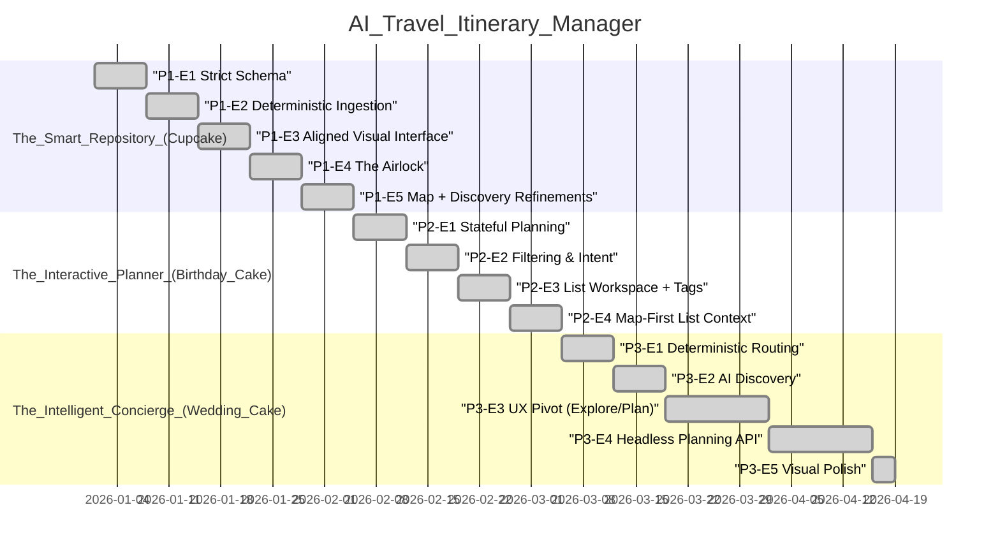

## Agent Quickstart
- Read `AGENTS.md`, `DESIGN.md`, and `docs/VIBE_PLAYBOOK.md` before making changes.
- For UI/UX changes, `DESIGN.md` is the source of truth for layout, interaction, visual system, and component inventory.
- Invariants: DB is source of truth; only approved pins are truth; enrich once, read forever; strict taxonomy; user edits never overwrite frozen AI enrichment.
- DoD: tests updated/added; verification steps; migrations + `npm run db:types` if schema changed; no TODO placeholders in Decisions / Rationale or Next Steps.
- Pointers: `supabase/migrations` for schema, `docs/reports` for learning reports. (`roadmap.json` is deprecated — `CONTEXT.md` is the single source of truth for phase status.)
- Starting a new task/chat? Use `prompts/agent_task.md`.
- Routing preview (Plan mode): set `ROUTING_PROVIDER` and `OSRM_BASE_URL` per [`.env.example`](.env.example); otherwise the API returns `501` / `provider_unavailable` by design.

## Active Context

**Current Phase:** P3-E5 — Visual Polish (just shipped)

**Previous:**
- P3-E4 (Headless Planning API) complete — slices A–H shipped. Only task 4.11 (in-app chat) deferred.
- P3-E3 (UX Pivot) complete — all 5 plan page slices, paper shell on all viewports, MapInset wired.

**P3-E5 status:** All 6 slices shipped. Cross-cutting UX refinements across Plan and Discover pages — layout fixes, map pin prominence, add-place UX.

### Architecture (locked decisions)

The app uses a **Two-Journey Architecture**: Explore (map + discovery) and Plan (day grid planner) as separate shells.

| Decision | Choice |
|----------|--------|
| Journey transition | Explicit mode switch (Explore ↔ Plan) via **PaperHeader** tabs (Map / Itinerary) on all viewports; URL `?mode=` |
| Map in planning mode | Mapbox **MapInset** in `PlannerShellPaper` with day-colored pins and day selection sync |
| Date mode | Real dates primary, Day 1/2/3 fallback when dateless |
| Schema for dateless trips | `day_index` nullable integer on `list_items` |
| Refactor strategy | Moderate: ExploreShell + PlannerShell, shared state layer |
| Insights layer | Separate epic, after planner is solid |

### Component tree (current)
```
AppShell
├── ExploreShellPaper (mode='explore')
│   ├── MapShell (full viewport map)
│   ├── PaperHeader (Map | Itinerary + Omnibox)
│   ├── PlannerListSwitcher (trip toolbar; URL list sync)
│   ├── PaperExplorePanel — md+: right rail; <md: bottom sheet (peek / half / expanded)
│   │   └── ListDrawer (embedded) | PlaceDrawer | InspectorCard
│   └── PaperMapControls
└── PlannerShellPaper (mode='plan')
    ├── PaperHeader
    ├── PlannerListSwitcher
    ├── MapInset (Mapbox minimap)
    └── CalendarPlanner (+ day detail / DnD)
```

**Unmounted legacy (still in repo):** `ExploreShell`, `PlannerShell`, `NavRail`, `NavFooter`, `ContextPanel` — not used by `AppShell`; see `DESIGN.md` legacy section.

### State stores
- `useTripStore` — shared: `activeListId`, items, placeIds, type filters, refresh key
- `useNavStore` — `mode: 'explore' | 'plan'`, URL sync (`?mode=`)
- `useDiscoveryStore` — Explore only: search, preview, enrichment state
- `CalendarPlanner` coordinates planner UI; scheduling mutations go through existing list item APIs

### P3-E3 Phase Status (complete)

| Phase | Status | What shipped |
|-------|--------|-------------|
| 0 — Foundation | **Done** | `day_index` migration, `useTripStore`, `useNavStore`, API `day_index` support |
| 1 — Shell Split | **Done** | `AppShell`, journey shells, URL mode switching (evolved to paper-only routing) |
| 2 — Planner Core | **Done** | `CalendarPlanner` in `PlannerShellPaper`; prior ListPlanner path legacy only |
| 3 — Map Inset | **Done** | `MapInset` in `PlannerShellPaper` with day-colored pins and selection sync |
| 4 — Polish + Cleanup | **Done** | Paper on all viewports, Explore parity toolbar/filters/dates, E2E tab selectors, date-shift migration (PATCH /api/lists/:id preserves item positions on date change) |

**Optional housekeeping:** delete legacy glass shells (`ExploreShell`, `PlannerShell`, `NavRail`, `NavFooter`), `WorkspaceContainer` alias, broader Playwright refresh.

### P3-E4 Slice Status

| Slice | Title | Status |
|-------|-------|--------|
| A | Contract + types | **Done** — `docs/PHASE_3_LIST_INTERCHANGE.md`, `lib/import/contract.ts` |
| B | Preview API (resolve + enrich) | **Done** — `app/api/lists/[id]/import/preview/route.ts` |
| C | Computed fields | **Done** — `lib/import/compute.ts` (haversine, hours, slots, energy) |
| D | Commit API | **Done** — `app/api/lists/[id]/import/commit/route.ts` |
| E | LLM client reference prompt | **Done** — `docs/LLM_PLANNING_CLIENT_PROMPT.md` |
| F | Export UI + round-trip IDs | **Done** — CSV download button, `place_id`/`google_place_id` columns |
| G | Import UI (upload/paste → preview → confirm) | **Done** — integrated into PlaceDrawer/ListDetailPanel |
| H | Verification gate | **Done** — `tests/import/contract.test.ts`, `compute.test.ts`, `commit-api.test.ts` |
| — | In-app chat (task 4.11) | **Deferred** — waiting on proven API usage before building chat UI |

### P3-E5 Slice Status (Visual Polish)

| Slice | Area | What | Status |
|-------|------|------|--------|
| VP-1 | Plan | Selected day cell visibility — inset highlight replacing clipped ring | **Done** |
| VP-2 | Plan | PaperHeader overlap — increased/dynamic padding-top for content area | **Done** |
| VP-3 | Plan | Calendar stretches to viewport, backlog/done pushed below fold | **Done** |
| VP-4 | Discover | Add-place card centering — equalized padding in drawer panel | **Done** |
| VP-5 | Discover | Ghost marker pulse animation on proposed pin | **Done** |
| VP-6 | Both | Pin prominence — larger pins (36px), colored rings by variant, stronger shadows | **Done** |

### What's Next

**Immediate options (pick one per session):**
1. **In-app chat UI (task 4.11)** — Conversational trip planning wired to preview/commit APIs. System prompt from slice E drives the LLM. Model-selectable backend.
2. **Legacy cleanup** — Remove unused glass shells (`ExploreShell`, `PlannerShell`, `NavRail`, `NavFooter`), `WorkspaceContainer` alias; expand Playwright coverage.
3. **Discover ↔ Plan map sync** — Selecting a list on Discover page flies the Plan map to that list's pins.
4. **Plan polish (continued)** — Routing badges, capacity warnings, or agenda view refinements per `docs/PLAN_PAGE_SLICES.md`.

**Deferred (separate epics):**
- Insights layer (distance warnings, closed-day alerts)
- Gemini API integration
- PDF export, deeper Google Maps / Notion integrations beyond current export formats
- Multi-trip views, collaborative editing

## Completed Phases

All phases below are complete. Details in git history.

- **P1 (Smart Repository):** Schema, ingestion, map, approval flow, lists
- **P2 (Interactive Planner):** Scheduling, filters, tags, map-first context, URL deep links, MapLibre, overlays
- **P3-E1:** OSRM routing adapter, travel-time badges
- **P3-E2:** AI discovery suggest endpoint, reject/discard path

## Roadmap


```mermaid
gantt
  dateFormat YYYY-MM-DD
  title AI_Travel_Itinerary_Manager
  section The_Smart_Repository_(Cupcake)
  "P1-E1 Strict Schema" :done, p1e1, 2026-01-01, 7d
  "P1-E2 Deterministic Ingestion" :done, p1e2, after p1e1, 7d
  "P1-E3 Aligned Visual Interface" :done, p1e3, after p1e2, 7d
  "P1-E4 The Airlock" :done, p1e4, after p1e3, 7d
  "P1-E5 Map + Discovery Refinements" :done, p1e5, after p1e4, 7d
  section The_Interactive_Planner_(Birthday_Cake)
  "P2-E1 Stateful Planning" :done, p2e1, after p1e5, 7d
  "P2-E2 Filtering & Intent" :done, p2e2, after p2e1, 7d
  "P2-E3 List Workspace + Tags" :done, p2e3, after p2e2, 7d
  "P2-E4 Map-First List Context" :done, p2e4, after p2e3, 7d
  section The_Intelligent_Concierge_(Wedding_Cake)
  "P3-E1 Deterministic Routing" :done, p3e1, after p2e4, 7d
  "P3-E2 AI Discovery" :done, p3e2, after p3e1, 7d
  "P3-E3 UX Pivot (Explore/Plan)" :done, p3e3, after p3e2, 14d
  "P3-E4 Headless Planning API" :done, p3e4, after p3e3, 14d
  "P3-E5 Visual Polish" :done, p3e5, after p3e4, 3d
```

## The Constitution
- LLMs label and translate intent; deterministic systems retrieve and compute.
- Only approved pins are truth (Map is the interface).
- Enrich Once, Read Forever (Frozen by default, versioned if refreshed).
- Strict Taxonomy: AI outputs must match UI Icon sets exactly.
- User edits never overwrite frozen AI enrichment.
