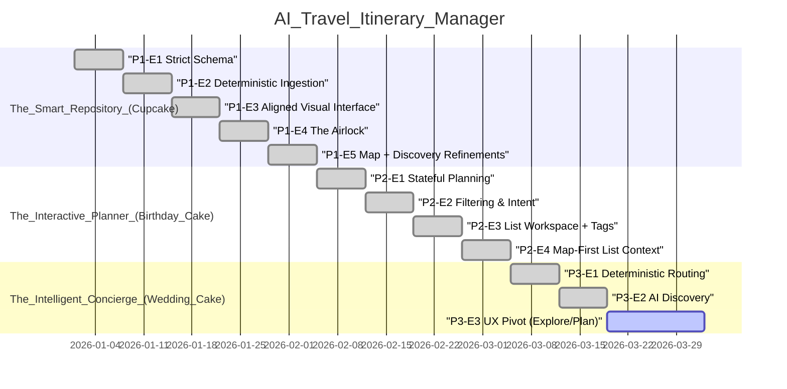

## Agent Quickstart
- Read `AGENTS.md`, `DESIGN.md`, and `docs/VIBE_PLAYBOOK.md` before making changes.
- For UI/UX changes, `DESIGN.md` is the source of truth for layout, interaction, visual system, and component inventory.
- Invariants: DB is source of truth; only approved pins are truth; enrich once, read forever; strict taxonomy; user edits never overwrite frozen AI enrichment.
- DoD: tests updated/added; verification steps; migrations + `npm run db:types` if schema changed; no TODO placeholders in Decisions / Rationale or Next Steps.
- Pointers: `roadmap.json` for phases, `supabase/migrations` for schema, `docs/reports` for learning reports.
- Starting a new task/chat? Use `prompts/agent_task.md`.
- Routing preview (Plan mode): set `ROUTING_PROVIDER` and `OSRM_BASE_URL` per [`.env.example`](.env.example); otherwise the API returns `501` / `provider_unavailable` by design.

## Active Context

**Current Phase:** P3-E3 — UX Pivot (Two-Journey Architecture)

### Architecture (locked decisions)

The app uses a **Two-Journey Architecture**: Explore (map + discovery) and Plan (day grid planner) as separate shells.

| Decision | Choice |
|----------|--------|
| Journey transition | Explicit mode switch (Explore ↔ Plan) via NavRail (desktop) / NavFooter (mobile) |
| Map in planning mode | Real Mapbox minimap inset with clickable pins (not yet built) |
| Date mode | Real dates primary, Day 1/2/3 fallback when dateless |
| Schema for dateless trips | `day_index` nullable integer on `list_items` |
| Refactor strategy | Moderate: ExploreShell + PlannerShell, shared state layer |
| Insights layer | Separate epic, after planner is solid |

### Component tree (current)
```
AppShell
├── NavRail (desktop ≥768px) / NavFooter (mobile <768px)
├── ExploreShell (mode='explore')
│   ├── MapShell (full viewport map)
│   ├── Omnibox (search)
│   ├── InspectorCard (preview/approve)
│   ├── ContextPanel (lists + place details)
│   └── ToolsSheet (layers, style)
└── PlannerShell (mode='plan')
    └── ListPlanner (layout='split' on desktop, 'column' on mobile)
        ├── Left: PlannerTripDates + PlannerBacklog + PlannerDayGrid + Done
        └── Right (desktop): PlannerDayDetail (persistent panel, 400px)
```

### State stores
- `useTripStore` — shared: `activeListId`, items, placeIds, type filters, refresh key
- `useNavStore` — `mode: 'explore' | 'plan'`, URL sync (`?mode=`)
- `useDiscoveryStore` — Explore only: search, preview, enrichment state
- ListPlanner manages its own data fetch + scheduling state internally

### P3-E3 Phase Status

| Phase | Status | What shipped |
|-------|--------|-------------|
| 0 — Foundation | **Done** | `day_index` migration, `useTripStore`, `useNavStore`, API `day_index` support |
| 1 — Shell Split | **Done** | `AppShell`, `ExploreShell`, `PlannerShell`, `NavRail`, `NavFooter`, URL mode switching |
| 2 — Planner Core | **Done** | ListPlanner wired into PlannerShell full-screen, desktop split-panel layout, bug fixes (unicode, slot labels, orphan warning, visual polish) |
| 3 — Map Inset | Not started | Real Mapbox minimap in PlannerShell with clickable pins |
| 4 — Polish + Cleanup | Partial | Bug fixes done. Remaining: deprecate old ListPlanner path from ExploreShell, remove WorkspaceContainer alias, E2E updates, doc alignment |

### What's Next

**Immediate options (pick one per session):**
1. **MapInset** — Add real Mapbox minimap to PlannerShell. Pins colored by day, fitBounds on day select, pin click scrolls to item. Lazy mount/destroy on mode switch.
2. **Date-shift migration** — When trip dates change, preserve item positions instead of silently dropping to backlog. Server-side logic in `PATCH /api/lists/:id`.
3. **Phase 4 cleanup** — Deprecate old ListPlanner in ExploreShell, remove WorkspaceContainer alias, update E2E selectors.

**Deferred (separate epics):**
- Insights layer (distance warnings, closed-day alerts)
- Gemini API integration
- Export (Google Maps, PDF)
- Multi-trip views, collaborative editing

## Completed Phases

All phases below are complete. Details in `roadmap.json` and git history.

- **P1 (Smart Repository):** Schema, ingestion, map, approval flow, lists
- **P2 (Interactive Planner):** Scheduling, filters, tags, map-first context, URL deep links, MapLibre, overlays
- **P3-E1:** OSRM routing adapter, travel-time badges
- **P3-E2:** AI discovery suggest endpoint, reject/discard path

## Roadmap


```mermaid
gantt
  dateFormat YYYY-MM-DD
  title AI_Travel_Itinerary_Manager
  section The_Smart_Repository_(Cupcake)
  "P1-E1 Strict Schema" :done, p1e1, 2026-01-01, 7d
  "P1-E2 Deterministic Ingestion" :done, p1e2, after p1e1, 7d
  "P1-E3 Aligned Visual Interface" :done, p1e3, after p1e2, 7d
  "P1-E4 The Airlock" :done, p1e4, after p1e3, 7d
  "P1-E5 Map + Discovery Refinements" :done, p1e5, after p1e4, 7d
  section The_Interactive_Planner_(Birthday_Cake)
  "P2-E1 Stateful Planning" :done, p2e1, after p1e5, 7d
  "P2-E2 Filtering & Intent" :done, p2e2, after p2e1, 7d
  "P2-E3 List Workspace + Tags" :done, p2e3, after p2e2, 7d
  "P2-E4 Map-First List Context" :done, p2e4, after p2e3, 7d
  section The_Intelligent_Concierge_(Wedding_Cake)
  "P3-E1 Deterministic Routing" :done, p3e1, after p2e4, 7d
  "P3-E2 AI Discovery" :done, p3e2, after p3e1, 7d
  "P3-E3 UX Pivot (Explore/Plan)" :active, p3e3, after p3e2, 14d
```

## The Constitution
- LLMs label and translate intent; deterministic systems retrieve and compute.
- Only approved pins are truth (Map is the interface).
- Enrich Once, Read Forever (Frozen by default, versioned if refreshed).
- Strict Taxonomy: AI outputs must match UI Icon sets exactly.
- User edits never overwrite frozen AI enrichment.
