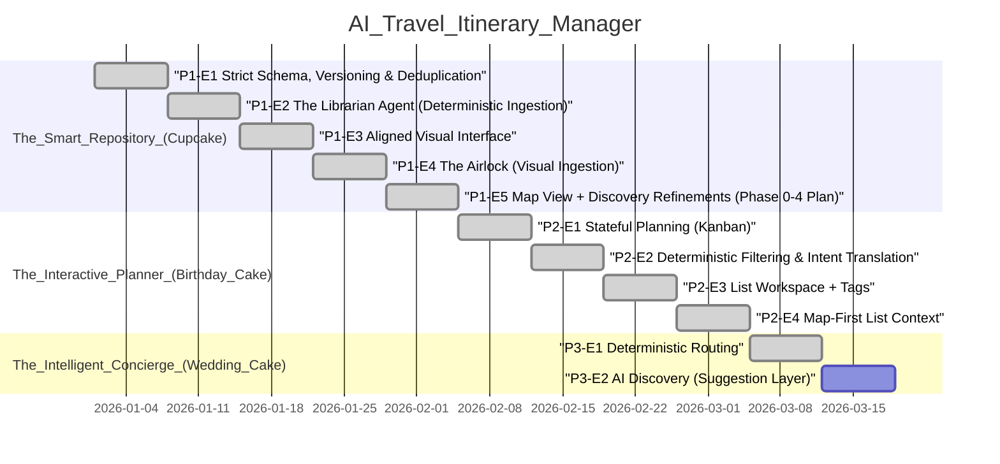

## Agent Quickstart
- Read `AGENTS.md`, `DESIGN.md`, and `docs/VIBE_PLAYBOOK.md` before making changes.
- For UI/UX changes, `DESIGN.md` is the source of truth for layout, interaction, visual system, and component inventory.
- Invariants: DB is source of truth; only approved pins are truth; enrich once, read forever; strict taxonomy; user edits never overwrite frozen AI enrichment.
- DoD: tests updated/added; verification steps; migrations + `npm run db:types` if schema changed; no TODO placeholders in Decisions / Rationale or Next Steps.
- Pointers: `roadmap.json` for phases, `supabase/migrations` for schema, `docs/reports` for learning reports.
- Starting a new task/chat? Use `prompts/agent_task.md`.

## 🧠 Active Context
- Current Phase: **UX Pivot — Two-Journey Architecture** (P3-E3) + The Intelligent Concierge (Wedding Cake)
- **Active work: UX Pivot** — replacing single WorkspaceContainer shell with Explore/Plan dual-journey architecture. Full spec: `docs/UX_PIVOT_PLAN.md`. Operationalization plan: `.claude/plans/logical-soaring-engelbart.md`.
  - Phase 0: Foundation (schema `day_index`, extract `useTripStore`, create `useNavStore`, API updates) — not started
  - Phase 1: Shell Split (AppShell, ExploreShell, PlannerShell, NavRail, NavFooter) — not started
  - Phase 2: Planner Core (PlannerGrid, DayCell, DayDetail, Backlog, `usePlannerStore`, DnD) — not started
  - Phase 3: Map Inset (real Mapbox minimap in PlannerShell) — not started
  - Phase 4: Polish + Cleanup (deprecate ListPlanner/WorkspaceContainer, E2E, docs) — not started
- P3-E1 complete: OSRM adapter, provider wiring, useRoutingPreview hook, travel-time badges.
- P3-E2 complete: reject/discard path and verification gate.
- Target architecture: `AppShell` → `ExploreShell` (map+discovery) | `PlannerShell` (day grid + map inset). Shared state: `useTripStore`, `useNavStore`. Shell-specific: `useDiscoveryStore` (Explore), `usePlannerStore` (Plan).

## ✅ P2-E1 Remaining Plan (Tracking)
- Spec: `docs/PHASE_2_KANBAN_SPEC.md`.
- [x] Decide slot encoding (MVP): sentinel `scheduled_start_time` values for Morning/Afternoon/Evening.
- [x] Add `Drinks` to `category_enum` + icon mapping + exhaustive tests; normalize bars → Drinks deterministically.
- [x] Implement list trip date write path: `PATCH /api/lists/[id]` (`start_date`, `end_date`, `timezone`).
- [x] Implement scheduling write path: `PATCH /api/lists/[id]/items/[itemId]` (date/slot/order/completed_at only + audit fields; `source` includes `tap_move`).
- [x] Add Planner view in map ContextPanel:
  - Desktop: right pane `Plan` mode (keeps list visible).
  - Mobile: `Places | Plan | Details` with Plan as a vertical agenda.
- [x] Mobile MVP: tap-to-move via `Move` picker + optimistic UI + calm/clear motion.
- [x] Desktop follow-up: DnD schedule + reorder within slot.
- [x] E2E: Playwright coverage for mobile Move picker schedule + Done/Backlog transitions.
- [x] E2E follow-up: desktop DnD scheduling/reorder/Done/Backlog persistence coverage.

## ✅ P2-E4 Remaining Plan (Tracking)
- [x] Decide URL contract: `/?place=<id>` map drawer deep link; keep `/places/[id]` full detail page.
- [x] Decide history semantics: URL open/close should create history entries so Back/Forward toggles drawer state.
- [x] Implement URL-driven drawer state in `components/map/MapContainer.tsx` (read/write `?place=`, close clears param, handle missing id by clearing param after load).
- [x] Convert every open/close path to URL (map click clears param + discovery, marker click sets param with propagation guard intact, PlaceDrawer close clears param, ListDrawer onPlaceSelect sets param).
- [x] Replace map-away navigation (Inspector approve + list detail selection) with map-shell `/?place=<id>`.
- [x] Preserve deep links through sign-in (include search params in `next`).
- [x] Add/extend Playwright tests for URL open/close + back/forward + marker click updates URL.
- [x] MapLibre feasibility note (token gating + mapbox entrypoint implications) captured in docs or roadmap.

## 🧭 MapLibre Feasibility Plan (Tracking)
- [x] Add provider flag (`NEXT_PUBLIC_MAP_PROVIDER=mapbox|maplibre`) and make token gating provider-aware.
- [x] Split renderers: `MapView.mapbox.tsx` / `MapView.maplibre.tsx` with `forwardRef` to preserve `mapRef`.
- [x] Move all Marker rendering (including GhostMarker) into the renderer to avoid mixed providers.
- [x] Make bounds + radius calculations provider-agnostic (remove `LngLatBounds` + `distanceTo`).
- [x] Add minimal MapLibre style JSON and wire the MapLibre renderer.
- [x] Optional: PMTiles protocol wiring + pmtiles style JSON for staged assets.
- [x] Document optional MapLibre Playwright run in `docs/PLAYWRIGHT.md`.

## 🧭 Map Customization (Tracking)
- [x] Transit overlay (NYC): add GeoJSON assets under `public/map/overlays/` (lines + optional stations).
- [x] Add right-overlay "Layers" toggle (pointer-events-auto) and accept drawer offset shift.
- [x] Render transit overlays in `MapView.*` (non-interactive layers, lazy-load/cached).
- [x] E2E: transit enabled does not block marker click → place drawer opens.
- [x] Map style selection: dark map style for Mapbox + MapLibre (map-only).
- [x] Neighborhood boundaries: NYC GeoJSON overlay (runtime layer).

## 🗺️ Roadmap Visualization

```mermaid
gantt
  dateFormat YYYY-MM-DD
  title AI_Travel_Itinerary_Manager
  section The_Smart_Repository_(Cupcake)
  "P1-E1 Strict Schema, Versioning & Deduplication" :done, p1e1, 2026-01-01, 7d
  "P1-E2 The Librarian Agent (Deterministic Ingestion)" :done, p1e2, after p1e1, 7d
  "P1-E3 Aligned Visual Interface" :done, p1e3, after p1e2, 7d
  "P1-E4 The Airlock (Visual Ingestion)" :done, p1e4, after p1e3, 7d
  "P1-E5 Map View + Discovery Refinements (Phase 0-4 Plan)" :done, p1e5, after p1e4, 7d
  section The_Interactive_Planner_(Birthday_Cake)
  "P2-E1 Stateful Planning (Kanban)" :done, p2e1, after p1e5, 7d
  "P2-E2 Deterministic Filtering & Intent Translation" :done, p2e2, after p2e1, 7d
  "P2-E3 List Workspace + Tags" :done, p2e3, after p2e2, 7d
  "P2-E4 Map-First List Context" :done, p2e4, after p2e3, 7d
  section The_Intelligent_Concierge_(Wedding_Cake)
  "P3-E1 Deterministic Routing" :done, p3e1, after p2e4, 7d
  "P3-E2 AI Discovery (Suggestion Layer)" :p3e2, after p3e1, 7d
```

## 📜 The Constitution
- LLMs label and translate intent; deterministic systems retrieve and compute.
- Only approved pins are truth (Map is the interface).
- Enrich Once, Read Forever (Frozen by default, versioned if refreshed).
- Strict Taxonomy: AI outputs must match UI Icon sets exactly.
- User edits never overwrite frozen AI enrichment.

## 📝 Implementation Memory
- 2026-02-26 – P3-E2 closeout: discard path for staged preview artifacts (tasks 2.6, 2.7). Added discard_place_candidate RPC, POST /api/places/discard, store discardAndClear; wired Close/Cancel/Escape/preview-switch/map-click to discard then clear; enrichments left intact (EORF). Tests: reject-route.test.ts, store discardAndClear. Docs and roadmap updated.
- 2026-02-26 – feat: complete P3-E2 task 2.4 summary isolation
    Auto-generated from git log (96f1fcb).
- 2026-02-26 – Draft P3-E2 discovery docs
    Auto-generated from git log (e684f35).
- 2026-02-26 – Implement deterministic routing API
    Auto-generated from git log (1a36875).
