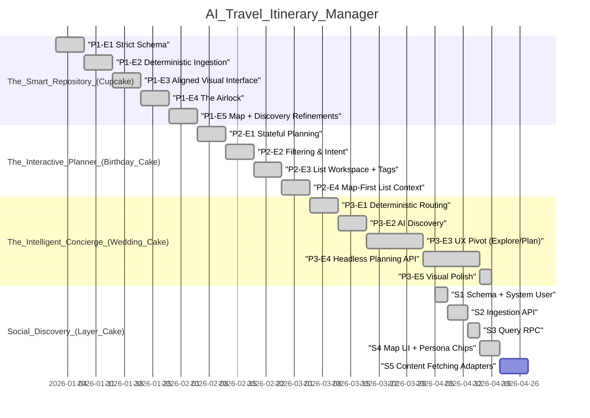

## Agent Quickstart
- Read `AGENTS.md`, `DESIGN.md`, and `docs/VIBE_PLAYBOOK.md` before making changes.
- For UI/UX changes, `DESIGN.md` is the source of truth for layout, interaction, visual system, and component inventory.
- Invariants: DB is source of truth; only approved pins are truth; enrich once, read forever; strict taxonomy; user edits never overwrite frozen AI enrichment.
- DoD: tests updated/added; verification steps; migrations + `npm run db:types` if schema changed; no TODO placeholders in Decisions / Rationale or Next Steps.
- Pointers: `supabase/migrations` for schema, `docs/reports` for learning reports.
- Starting a new task/chat? Use `prompts/agent_task.md`.
- Routing preview (Plan mode): set `ROUTING_PROVIDER` and `OSRM_BASE_URL` per [`.env.example`](.env.example); otherwise the API returns `501` / `provider_unavailable` by design.

## Active Context

**Current Phase:** Social Discovery Pipeline — S1-S4 shipped (schema, ingestion API, RPC query, map UI)

**Previous (all complete):**
- Transit Coverage (Slices 1, 2, 4) — GTFS proxy, per-line rendering, mode sub-toggles. Manual overrides + OSM fallback (S1–S5) partially complete.
- P3-E5 (Visual Polish) — selected day visibility, header overlap, calendar viewport, pin prominence, ghost marker pulse, add-place card
- P3-E4 (Headless Planning API) — slices A–H shipped. Task 4.11 (in-app chat) deferred.
- P3-E3 (UX Pivot) — all 5 plan page slices, paper shell on all viewports, MapInset wired.
- Map Layer Toggle + Transit Layer — `useMapLayerStore`, layer picker in PaperHeader, GTFS vector tile transit with per-mode sub-toggles (subway/bus/rail/ferry), canonical mode normalization, subtle per-type styling
- Multi-User Collab P1–P3 — `list_shares` + `list_collaborators` schema, share link generation, anonymous join flow, `ShareListButton`, async sync via visibility-change refetch, `PlannerFreshnessLabel`

### Social Discovery Pipeline Status

Full spec: [`docs/SOCIAL_DISCOVERY_PIPELINE.md`](docs/SOCIAL_DISCOVERY_PIPELINE.md)

**Invariant — Logic over Magic:** AI runs strictly in the async ingestion pipeline. Map UI is driven by deterministic Postgres queries. No LLM calls at render time.

| Slice | What | Status |
|-------|------|--------|
| S1 | Schema: `social_sources`, `social_mentions`, `persona_enum`, system user | **Done** |
| S2 | Ingestion API: `POST /api/enrichment/ingest-social` (LLM extraction -> Google resolve -> upserts) | **Done** |
| S3 | Query layer: `discover_social_places` RPC (mention counts, persona filter, snippets) | **Done** |
| S4 | Map UI: persona toggle chips, mention-scaled markers, mention sidebar in PlaceDrawer | **Done** |
| S5a | Content fetch lib + API: `POST /api/enrichment/fetch-content` (YouTube transcript + blog extraction) | **Active** |
| S5b | URL paste UI in ExplorePanel → chains fetch → ingest → map refresh | Blocked on S5a |

### Transit Coverage Status (paused)

6 of 12 top travel cities have no subway/metro data from Transitland. Three-tier fallback plan at `docs/TRANSIT_COVERAGE_PLAN.md`.

S1–S5 all TODO. Paused in favor of Social Discovery Pipeline.

### Architecture (locked decisions)

The app uses a **Two-Journey Architecture**: Explore (map + discovery) and Plan (day grid planner) as separate shells.

| Decision | Choice |
|----------|--------|
| Journey transition | Explicit mode switch (Explore ↔ Plan) via **PaperHeader** tabs (Map / Itinerary) on all viewports; URL `?mode=` |
| Map in planning mode | Mapbox **MapInset** in `PlannerShellPaper` with day-colored pins and day selection sync |
| Date mode | Real dates primary, Day 1/2/3 fallback when dateless |
| Schema for dateless trips | `day_index` nullable integer on `list_items` |
| Refactor strategy | Moderate: ExploreShell + PlannerShell, shared state layer |
| Insights layer | Separate epic, after planner is solid |

### Component tree (current)
```
AppShell
├── ExploreShellPaper (mode='explore')
│   ├── MapShell (full viewport map)
│   ├── PaperHeader (Map | Itinerary + Omnibox)
│   ├── PlannerListSwitcher (trip toolbar; URL list sync)
│   ├── PaperExplorePanel — md+: right rail; <md: bottom sheet (peek / half / expanded)
│   │   └── ListDrawer (embedded) | PlaceDrawer | InspectorCard
│   └── PaperMapControls
└── PlannerShellPaper (mode='plan')
    ├── PaperHeader
    ├── PlannerListSwitcher
    ├── MapInset (Mapbox minimap)
    └── CalendarPlanner (+ day detail / DnD)
```

**Deleted legacy:** `ExploreShell`, `PlannerShell`, `NavRail`, `NavFooter`, `ContextPanel`, `WorkspaceContainer`, `MapContainer` — removed; see `DESIGN.md` legacy section for the superseded layout.

### State stores
- `useTripStore` — shared: `activeListId`, items, placeIds, type filters, refresh key
- `useNavStore` — `mode: 'explore' | 'plan'`, URL sync (`?mode=`)
- `useDiscoveryStore` — Explore only: search, preview, enrichment state
- `CalendarPlanner` coordinates planner UI; scheduling mutations go through existing list item APIs

### P3-E3 Phase Status (complete)

| Phase | Status | What shipped |
|-------|--------|-------------|
| 0 — Foundation | **Done** | `day_index` migration, `useTripStore`, `useNavStore`, API `day_index` support |
| 1 — Shell Split | **Done** | `AppShell`, journey shells, URL mode switching (evolved to paper-only routing) |
| 2 — Planner Core | **Done** | `CalendarPlanner` in `PlannerShellPaper`; prior ListPlanner path legacy only |
| 3 — Map Inset | **Done** | `MapInset` in `PlannerShellPaper` with day-colored pins and selection sync |
| 4 — Polish + Cleanup | **Done** | Paper on all viewports, Explore parity toolbar/filters/dates, E2E tab selectors, date-shift migration (PATCH /api/lists/:id preserves item positions on date change) |

**Housekeeping done:** legacy glass shells and `WorkspaceContainer` deleted. Optional: broader Playwright coverage refresh.

### P3-E4 Slice Status

| Slice | Title | Status |
|-------|-------|--------|
| A | Contract + types | **Done** — `docs/PHASE_3_LIST_INTERCHANGE.md`, `lib/import/contract.ts` |
| B | Preview API (resolve + enrich) | **Done** — `app/api/lists/[id]/import/preview/route.ts` |
| C | Computed fields | **Done** — `lib/import/compute.ts` (haversine, hours, slots, energy) |
| D | Commit API | **Done** — `app/api/lists/[id]/import/commit/route.ts` |
| E | LLM client reference prompt | **Done** — `docs/LLM_PLANNING_CLIENT_PROMPT.md` |
| F | Export UI + round-trip IDs | **Done** — CSV download button, `place_id`/`google_place_id` columns |
| G | Import UI (upload/paste → preview → confirm) | **Done** — integrated into PlaceDrawer/ListDetailPanel |
| H | Verification gate | **Done** — `tests/import/contract.test.ts`, `compute.test.ts`, `commit-api.test.ts` |
| — | In-app chat (task 4.11) | **Deferred** — waiting on proven API usage before building chat UI |

### P3-E5 Slice Status (Visual Polish)

| Slice | Area | What | Status |
|-------|------|------|--------|
| VP-1 | Plan | Selected day cell visibility — inset highlight replacing clipped ring | **Done** |
| VP-2 | Plan | PaperHeader overlap — increased/dynamic padding-top for content area | **Done** |
| VP-3 | Plan | Calendar stretches to viewport, backlog/done pushed below fold | **Done** |
| VP-4 | Discover | Add-place card centering — equalized padding in drawer panel | **Done** |
| VP-5 | Discover | Ghost marker pulse animation on proposed pin | **Done** |
| VP-6 | Both | Pin prominence — larger pins (36px), colored rings by variant, stronger shadows | **Done** |

### What's Next

**Immediate (active):**
- **S5a — Content fetch lib + API** (`cursor-prompts/social-s5-fetch-content.md`): install `youtube-transcript` + `node-html-parser`, create `lib/server/social/fetch-content.ts` + `POST /api/enrichment/fetch-content`. Cursor task.
- **S5b — URL ingest UI** (`cursor-prompts/social-s5-ingest-ui.md`): URL paste input in ExplorePanel that chains fetch → ingest → map refresh. Blocked on S5a.

**Queued (pick next):**
- **Social Discovery S5b (ingest UI)** — URL paste input in ExplorePanel, chains fetch-content → ingest-social → map refresh (blocked on S5a)
- **Transit coverage S1-S5** — Manual overrides + OSM Overpass fallback (paused, not blocked)
- **In-app chat UI (task 4.11)** — Conversational trip planning wired to preview/commit APIs
- **Discover ↔ Plan map sync** — Selecting a list on Discover page flies the Plan map to that list's pins
- **Collab P4 (Realtime)** — Supabase Realtime Postgres Changes + Presence

**Deferred (separate epics):**
- Insights layer (distance warnings, closed-day alerts)
- Content fetching (YouTube transcript API, TikTok scraping) — upstream of social pipeline
- PDF export, deeper Google Maps / Notion integrations

## Completed Phases

All phases below are complete. Details in git history.

- **P1 (Smart Repository):** Schema, ingestion, map, approval flow, lists
- **P2 (Interactive Planner):** Scheduling, filters, tags, map-first context, URL deep links, MapLibre, overlays
- **P3-E1:** OSRM routing adapter, travel-time badges
- **P3-E2:** AI discovery suggest endpoint, reject/discard path
- **P3-E3:** UX Pivot — Two-Journey Architecture (Explore/Plan), CalendarPlanner, MapInset, date-shift migration
- **P3-E4:** Headless Planning API — import/export contract, preview/commit APIs, LLM client prompt, import UI
- **P3-E5:** Visual Polish — selected day cell, header overlap, calendar viewport, pin prominence, ghost marker
- **Social Discovery S1-S4:** schema + system user, ingest API, discover RPC, persona chips + scaled markers + drawer mentions
- **Map Layer Toggle:** `useMapLayerStore`, layer picker (default/transit/terrain), GTFS vector tile transit, per-mode sub-toggles, subtle per-type styling, per-user persistence
- **Multi-User Collab P1–P3:** Share links, anonymous join flow, `ShareListButton`, async sync, `PlannerFreshnessLabel`
- **Transit Coverage (partial):** Per-line GTFS rendering (slices 1,2,4), mode sub-toggles, canonical normalization, Supabase cache

## Roadmap


```mermaid
gantt
  dateFormat YYYY-MM-DD
  title AI_Travel_Itinerary_Manager
  section The_Smart_Repository_(Cupcake)
  "P1-E1 Strict Schema" :done, p1e1, 2026-01-01, 7d
  "P1-E2 Deterministic Ingestion" :done, p1e2, after p1e1, 7d
  "P1-E3 Aligned Visual Interface" :done, p1e3, after p1e2, 7d
  "P1-E4 The Airlock" :done, p1e4, after p1e3, 7d
  "P1-E5 Map + Discovery Refinements" :done, p1e5, after p1e4, 7d
  section The_Interactive_Planner_(Birthday_Cake)
  "P2-E1 Stateful Planning" :done, p2e1, after p1e5, 7d
  "P2-E2 Filtering & Intent" :done, p2e2, after p2e1, 7d
  "P2-E3 List Workspace + Tags" :done, p2e3, after p2e2, 7d
  "P2-E4 Map-First List Context" :done, p2e4, after p2e3, 7d
  section The_Intelligent_Concierge_(Wedding_Cake)
  "P3-E1 Deterministic Routing" :done, p3e1, after p2e4, 7d
  "P3-E2 AI Discovery" :done, p3e2, after p3e1, 7d
  "P3-E3 UX Pivot (Explore/Plan)" :done, p3e3, after p3e2, 14d
  "P3-E4 Headless Planning API" :done, p3e4, after p3e3, 14d
  "P3-E5 Visual Polish" :done, p3e5, after p3e4, 3d
  section Social_Discovery_(Layer_Cake)
  "S1 Schema + System User" :done, s1, 2026-04-05, 3d
  "S2 Ingestion API" :done, s2, after s1, 5d
  "S3 Query RPC" :done, s3, after s2, 3d
  "S4 Map UI + Persona Chips" :done, s4, after s3, 5d
  "S5 Content Fetching Adapters" :s5, after s4, 7d
```

## The Constitution
- LLMs label and translate intent; deterministic systems retrieve and compute.
- Only approved pins are truth (Map is the interface).
- Enrich Once, Read Forever (Frozen by default, versioned if refreshed).
- Strict Taxonomy: AI outputs must match UI Icon sets exactly.
- User edits never overwrite frozen AI enrichment.
