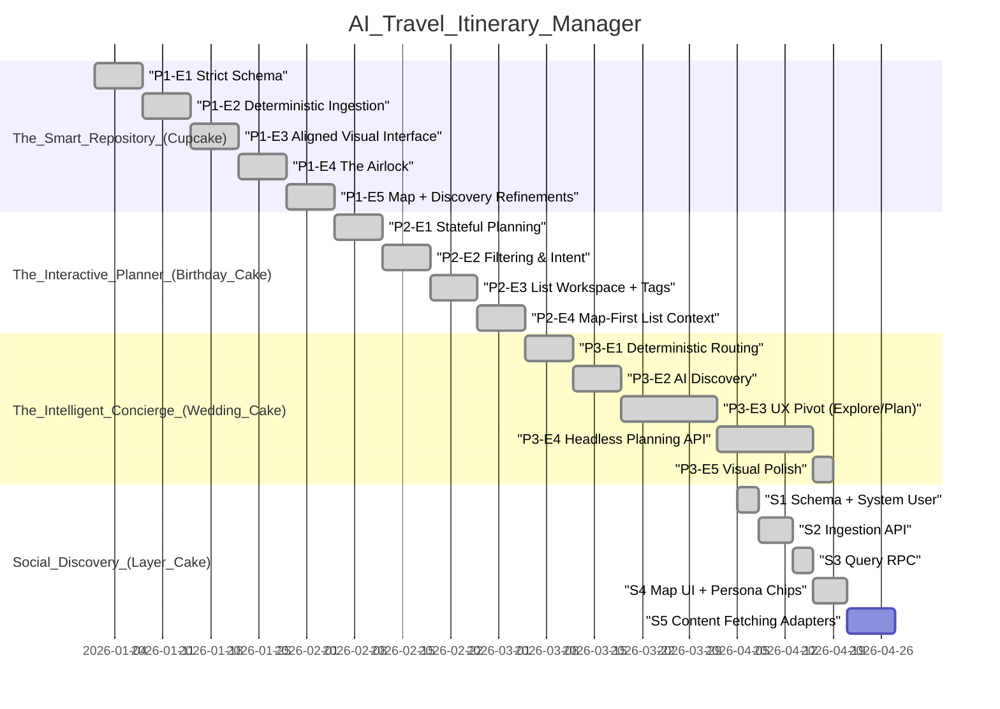

## Agent Quickstart
- Read `AGENTS.md`, `DESIGN.md`, and `docs/VIBE_PLAYBOOK.md` before making changes.
- For UI/UX changes, `DESIGN.md` is the source of truth for layout, interaction, visual system, and component inventory.
- Invariants: DB is source of truth; only approved pins are truth; enrich once, read forever; strict taxonomy; user edits never overwrite frozen AI enrichment.
- DoD: tests updated/added; verification steps; migrations + `npm run db:types` if schema changed; no TODO placeholders in Decisions / Rationale or Next Steps.
- Pointers: `supabase/migrations` for schema, `docs/reports` for learning reports.
- Starting a new task/chat? Use `cursor-prompts/agent_task.md`.
- Routing preview (Plan mode): set `ROUTING_PROVIDER` and `OSRM_BASE_URL` per [`.env.example`](.env.example); otherwise the API returns `501` / `provider_unavailable` by design.

## Active Context

**Current Phase:** S7–S10 research workspace shipped + post-merge hardening (2026-04-09)

**Just landed (this session):**
- S7–S10 research workspace (Cursor cloud agent branch, already merged to main): `list_type`, `list_sources`, `research_votes`, `discover_research_places` RPC, `ResearchTriagePanel`, overlap triage UI, vote + add-to-trip flows
- Post-merge fixes (4 parallel slices via Cursor prompts):
  - Migration `20260414000001`: research_votes DELETE policy now requires list access; `list_sources` collaborator policy cleaned up; `discover_research_places` RPC rewritten with CTE (was LATERAL per-place)
  - `ResearchTriagePanel`: `createResearchList()` now surfaces errors in UI; `buildProvenanceNotes` shows `[truncated]` indicator
  - `POST /api/lists/[id]/items`: social places scoped to attached sources only (was any `source='social'`)
  - `lib/social/research-queries.ts`: `ResearchPlaceRow.category` typed as `CategoryEnum`; 4 new edge-case tests (6 total)

**In progress:**
- Playwright E2E for research flows — `tests/e2e/research.spec.ts` is template scaffolding with generic selectors; needs selector alignment with paper shell UI + auth flow wiring to existing `playwright/global-setup.ts`. Config at `tests/e2e/playwright.config.ts` duplicates root config — consolidate to root.

**Known issues (open, next session):**
- `ResearchTriagePanel` is 525 lines / 13 useState — should split before S11/S12 work
- Next substantive edit to `SourcesShellPaper.tsx`: consider regression tests for list overlay + `suppressPlaceFetch` / `displayMapPlaces` → `socialPlaces` (file is complex; parity tests were deferred)
- Social places from original YouTube vlog import still appear in the saved list — these predate the `places_view` filter and are already in `list_items` from the ingest flow; needs a data cleanup or ingest-path fix so social places aren't auto-added to lists on import
- Sources page has no list picker for "Add to list" — `SourcesPanel` hardcodes `activeListId` from `useTripStore`; user cannot choose which trip list to save a source place to

**Previous (all complete):**
- Sources H — `suppressPlaceFetch` on MapShell, list overlay chips, `isUnvetted`/`isOverlay` marker branches, RLS recursion fix, `places_view` social filter, category emoji live-update
- Sources E–G — map view for source places (lat/lng in v3 RPC, direct from `selectedSource.places`), chip visual refresh (`paper-chip-active` gray + 6px radius), card-to-map highlight (scout mode, imperative `flyTo` via `MapShellHandle` ref)
- Bug fixes this session: add-to-list 400 (place_id in body not query param), RLS 500 (social places blocked by `list_items` WITH CHECK), map flyTo wrong place (init effect re-firing on `allPlaces` changes)
- Sources Workspace Redesign A–F — tags/callouts schema, ratings on places, `list_user_social_sources()` v3 (+ lat/lng), SourcesPanel rich place cards, desktop split layout, Sources tab always visible
- Visual Refresh VR-1 — `InspectorCard` paper chip/button/surface refresh, glass + tone branches removed
- Social Discovery S1–S6 — schema, ingestion API, RPC query, map UI (persona chips + scaled markers), content fetch (YouTube/blog), async job queue + Vercel cron, Realtime map refresh, Sources mode shell
- Transit Coverage (Slices 1, 2, 4) — GTFS proxy, per-line rendering, mode sub-toggles. Manual overrides + OSM fallback paused.
- P3-E5 (Visual Polish) — selected day visibility, header overlap, calendar viewport, pin prominence, ghost marker pulse, add-place card
- P3-E4 (Headless Planning API) — slices A–H shipped. Task 4.11 (in-app chat) deferred.
- P3-E3 (UX Pivot) — all 5 plan page slices, paper shell on all viewports, MapInset wired.
- Map Layer Toggle + Transit Layer — `useMapLayerStore`, layer picker in PaperHeader, GTFS vector tile transit with per-mode sub-toggles, canonical mode normalization, subtle per-type styling
- Multi-User Collab P1–P3 — `list_shares` + `list_collaborators` schema, share link generation, anonymous join flow, `ShareListButton`, async sync, `PlannerFreshnessLabel`
- E2E test rewrite — paper shell selector/flow refresh for `paper-shell-responsive`, list/map/planner specs, and social ingest tests (`cursor-prompts/e2e-test-rewrite.md`)

### Social Discovery Pipeline — COMPLETE (S1–S6)

Full spec: [`docs/SOCIAL_DISCOVERY_PIPELINE.md`](docs/SOCIAL_DISCOVERY_PIPELINE.md)

**Invariant — Logic over Magic:** AI runs strictly in the async ingestion pipeline. Map UI is driven by deterministic Postgres queries. No LLM calls at render time.

| Slice | What | Status |
|-------|------|--------|
| S1 | Schema: `social_sources`, `social_mentions`, `persona_enum`, system user | **Done** |
| S2 | Ingestion API: `POST /api/enrichment/ingest-social` (LLM extraction → Google resolve → upserts) | **Done** |
| S3 | Query layer: `discover_social_places` RPC (mention counts, persona filter, snippets) | **Done** |
| S4 | Map UI: persona toggle chips, mention-scaled markers, mention sidebar in PlaceDrawer | **Done** |
| S5a | Content fetch lib + API: `POST /api/enrichment/fetch-content` (YouTube transcript + blog extraction) | **Done** |
| S5b | URL paste UI → `social_ingest_jobs` queue + worker + Vercel cron + Realtime map refresh | **Done** |
| S5c | Async queue: `claim_next_social_job()` RPC, chunking + batched Gemini | **Done** |
| S6 | Sources mode: `SourcesShellPaper`, `SourcesPanel`, `user_social_sources` table, `useSourcesStore`, `import-from-sources` API | **Done** |

### Visual Refresh Status

| Slice | Area | What | Status |
|-------|------|------|--------|
| VR-1 | Discover | `InspectorCard` paper-surface chip/button/input refresh; remove legacy glass + tone branches | **Done** |

### Transit Coverage Status (paused)

6 of 12 top travel cities have no subway/metro data from Transitland. Three-tier fallback plan at `docs/TRANSIT_COVERAGE_PLAN.md`.

S1–S5 all TODO. Paused in favor of Social Discovery Pipeline.

### Architecture (locked decisions)

The app uses a **Two-Journey Architecture**: Explore (map + discovery) and Plan (day grid planner) as separate shells.

| Decision | Choice |
|----------|--------|
| Journey transition | Explicit mode switch (Explore ↔ Plan) via **PaperHeader** tabs (Map / Itinerary) on all viewports; URL `?mode=` |
| Map in planning mode | Mapbox **MapInset** in `PlannerShellPaper` with day-colored pins and day selection sync |
| Date mode | Real dates primary, Day 1/2/3 fallback when dateless |
| Schema for dateless trips | `day_index` nullable integer on `list_items` |
| Refactor strategy | Moderate: ExploreShell + PlannerShell, shared state layer |
| Insights layer | Separate epic, after planner is solid |

### Component tree (current)
```
AppShell
├── ExploreShellPaper (mode='explore')
│   ├── MapShell (full viewport map)
│   ├── PaperHeader (Map | Itinerary + Omnibox)
│   ├── PlannerListSwitcher (trip toolbar; URL list sync)
│   ├── PaperExplorePanel — md+: right rail; <md: bottom sheet (peek / half / expanded)
│   │   └── ListDrawer (embedded) | PlaceDrawer | InspectorCard
│   └── PaperMapControls
└── PlannerShellPaper (mode='plan')
    ├── PaperHeader
    ├── PlannerListSwitcher
    ├── MapInset (Mapbox minimap)
    └── CalendarPlanner (+ day detail / DnD)
```

**Deleted legacy:** `ExploreShell`, `PlannerShell`, `NavRail`, `NavFooter`, `ContextPanel`, `WorkspaceContainer`, `MapContainer` — removed; see `DESIGN.md` legacy section for the superseded layout.

### State stores
- `useTripStore` — shared: `activeListId`, items, placeIds, type filters, refresh key
- `useNavStore` — `mode: 'explore' | 'plan'`, URL sync (`?mode=`)
- `useDiscoveryStore` — Explore only: search, preview, enrichment state
- `CalendarPlanner` coordinates planner UI; scheduling mutations go through existing list item APIs

### P3-E3 Phase Status (complete)

| Phase | Status | What shipped |
|-------|--------|-------------|
| 0 — Foundation | **Done** | `day_index` migration, `useTripStore`, `useNavStore`, API `day_index` support |
| 1 — Shell Split | **Done** | `AppShell`, journey shells, URL mode switching (evolved to paper-only routing) |
| 2 — Planner Core | **Done** | `CalendarPlanner` in `PlannerShellPaper`; prior ListPlanner path legacy only |
| 3 — Map Inset | **Done** | `MapInset` in `PlannerShellPaper` with day-colored pins and selection sync |
| 4 — Polish + Cleanup | **Done** | Paper on all viewports, Explore parity toolbar/filters/dates, E2E tab selectors, date-shift migration (PATCH /api/lists/:id preserves item positions on date change) |

**Housekeeping done:** legacy glass shells and `WorkspaceContainer` deleted. Optional: broader Playwright coverage refresh.

### P3-E4 Slice Status

| Slice | Title | Status |
|-------|-------|--------|
| A | Contract + types | **Done** — `docs/PHASE_3_LIST_INTERCHANGE.md`, `lib/import/contract.ts` |
| B | Preview API (resolve + enrich) | **Done** — `app/api/lists/[id]/import/preview/route.ts` |
| C | Computed fields | **Done** — `lib/import/compute.ts` (haversine, hours, slots, energy) |
| D | Commit API | **Done** — `app/api/lists/[id]/import/commit/route.ts` |
| E | LLM client reference prompt | **Done** — `docs/LLM_PLANNING_CLIENT_PROMPT.md` |
| F | Export UI + round-trip IDs | **Done** — CSV download button, `place_id`/`google_place_id` columns |
| G | Import UI (upload/paste → preview → confirm) | **Done** — integrated into PlaceDrawer/ListDetailPanel |
| H | Verification gate | **Done** — `tests/import/contract.test.ts`, `compute.test.ts`, `commit-api.test.ts` |
| — | In-app chat (task 4.11) | **Deferred** — waiting on proven API usage before building chat UI |

### P3-E5 Slice Status (Visual Polish)

| Slice | Area | What | Status |
|-------|------|------|--------|
| VP-1 | Plan | Selected day cell visibility — inset highlight replacing clipped ring | **Done** |
| VP-2 | Plan | PaperHeader overlap — increased/dynamic padding-top for content area | **Done** |
| VP-3 | Plan | Calendar stretches to viewport, backlog/done pushed below fold | **Done** |
| VP-4 | Discover | Add-place card centering — equalized padding in drawer panel | **Done** |
| VP-5 | Discover | Ghost marker pulse animation on proposed pin | **Done** |
| VP-6 | Both | Pin prominence — larger pins (36px), colored rings by variant, stronger shadows | **Done** |

### What's Next

See [`PRD.md`](PRD.md) for the full shaped roadmap. Summary:

**Immediate (N1–N4):**
- **N1** — Search: stop showing active-list places when searching a new city
- **N2** — Remove social source URLs from PlaceDrawer — **Done**
- **N3** — Transit layer loading spinner
- **N4** — Richer search result preview (reviews, directions link) — **Done**

**Next (N5):**
- **N5** — Sources research hub: enriched place cards, video thumbnails, layout rebalance (N5c: layout rebalance — Done), research list drawer

**Queued (N6–N7 + backlog):**
- **N6** — Directions button + multi-stop flow (needs shaping)
- **N7** — Street View integration (noted, needs cost research)
- Sources I (list picker), Sources phase 2, TikTok adapter, transit coverage, in-app chat, map sync, Collab P4

**Deferred (separate epics):**
- Insights layer (distance warnings, closed-day alerts)
- PDF export, deeper Google Maps / Notion integrations

## Completed Phases

All phases below are complete. Details in git history.

- **P1 (Smart Repository):** Schema, ingestion, map, approval flow, lists
- **P2 (Interactive Planner):** Scheduling, filters, tags, map-first context, URL deep links, MapLibre, overlays
- **P3-E1:** OSRM routing adapter, travel-time badges
- **P3-E2:** AI discovery suggest endpoint, reject/discard path
- **P3-E3:** UX Pivot — Two-Journey Architecture (Explore/Plan), CalendarPlanner, MapInset, date-shift migration
- **P3-E4:** Headless Planning API — import/export contract, preview/commit APIs, LLM client prompt, import UI
- **P3-E5:** Visual Polish — selected day cell, header overlap, calendar viewport, pin prominence, ghost marker
- **Social Discovery S1–S6:** schema + system user, ingest API, discover RPC, persona chips + scaled markers + drawer mentions, content fetch (YouTube/blog), async job queue + cron + Realtime, Sources mode shell
- **Sources Workspace Redesign A–H (in progress):** A–G complete — schema+pipeline (tags/callouts/ratings + lat/lng), redesigned panel cards, desktop split, source-filtered map pins (direct lat/lng), chip refresh, card-to-map scout mode. H shaped (clean map + list overlay + unvetted markers).
- **Map Layer Toggle:** `useMapLayerStore`, layer picker (default/transit/terrain), GTFS vector tile transit, per-mode sub-toggles, subtle per-type styling, per-user persistence
- **Multi-User Collab P1–P3:** Share links, anonymous join flow, `ShareListButton`, async sync, `PlannerFreshnessLabel`
- **Transit Coverage (partial):** Per-line GTFS rendering (slices 1,2,4), mode sub-toggles, canonical normalization, Supabase cache

## Roadmap


```mermaid
gantt
  dateFormat YYYY-MM-DD
  title AI_Travel_Itinerary_Manager
  section The_Smart_Repository_(Cupcake)
  "P1-E1 Strict Schema" :done, p1e1, 2026-01-01, 7d
  "P1-E2 Deterministic Ingestion" :done, p1e2, after p1e1, 7d
  "P1-E3 Aligned Visual Interface" :done, p1e3, after p1e2, 7d
  "P1-E4 The Airlock" :done, p1e4, after p1e3, 7d
  "P1-E5 Map + Discovery Refinements" :done, p1e5, after p1e4, 7d
  section The_Interactive_Planner_(Birthday_Cake)
  "P2-E1 Stateful Planning" :done, p2e1, after p1e5, 7d
  "P2-E2 Filtering & Intent" :done, p2e2, after p2e1, 7d
  "P2-E3 List Workspace + Tags" :done, p2e3, after p2e2, 7d
  "P2-E4 Map-First List Context" :done, p2e4, after p2e3, 7d
  section The_Intelligent_Concierge_(Wedding_Cake)
  "P3-E1 Deterministic Routing" :done, p3e1, after p2e4, 7d
  "P3-E2 AI Discovery" :done, p3e2, after p3e1, 7d
  "P3-E3 UX Pivot (Explore/Plan)" :done, p3e3, after p3e2, 14d
  "P3-E4 Headless Planning API" :done, p3e4, after p3e3, 14d
  "P3-E5 Visual Polish" :done, p3e5, after p3e4, 3d
  section Social_Discovery_(Layer_Cake)
  "S1 Schema + System User" :done, s1, 2026-04-05, 3d
  "S2 Ingestion API" :done, s2, after s1, 5d
  "S3 Query RPC" :done, s3, after s2, 3d
  "S4 Map UI + Persona Chips" :done, s4, after s3, 5d
  "S5 Content Fetching Adapters" :s5, after s4, 7d
```

## Sources Research Workspace (agreed plan)

### MVP vertical slice: Overlap Triage
- User creates a `research` list and attaches ingested social sources (initially YouTube/blog).
- UI shows deterministic places for that active research list only, sorted by unique source overlap (`3 sources`, `2 sources`, ...).
- Map mirrors the same place set, with viewport-bounded querying via "Search this area".
- Each place supports two primary actions: +/- voting (reversible per-user curation) and `Add to Trip` (create standard `list_item` in selected `trip` list).
- Shared research list links reproduce the same attached sources + vote state and deterministic ranked output.

### Phase order (locked)
1. **Phase 1 — Aggregator MVP (S7, S8, S9, S10)** — **Done** (schema + RPC + Sources UI: research list, attach sources, overlap cards, map bounds search, votes, add-to-trip with `list_items.notes` provenance)
   - `list_type` boundaries (`trip` vs `research`)
   - overlap ranking in list/map
   - viewport-bounded query loop ("Search this area")
   - per-user +/- vote persistence
   - add-to-trip mutation
2. **Phase 2 — Curation + Compare (S11, S12)**
   - compare surface, source-specific context, richer curation UX
3. **Phase 3 — Ecosystem Expansion (S13)**
   - TikTok adapter + metadata fallback + queue scale tuning

### Data/contract direction (for implementation)
- Extend existing collaboration/list architecture; do not build a parallel workspace model.
- `lists`: add `list_type: 'trip' | 'research'`.
- `list_sources`: junction table binding `list_id` ↔ `source_id`.
- `research_votes`: scoped vote layer keyed by unique `(list_id, place_id, user_id)` with `vote_value IN (-1, 1)`.
- `discover_research_places`: deterministic RPC scoped to active `list_id`, optional viewport bounds, and stable sort by overlap then score.
- Preserve invariant: user curation never overwrites frozen AI enrichment records.

## The Constitution
- LLMs label and translate intent; deterministic systems retrieve and compute.
- Only approved pins are truth (Map is the interface).
- Enrich Once, Read Forever (Frozen by default, versioned if refreshed).
- Strict Taxonomy: AI outputs must match UI Icon sets exactly.
- User edits never overwrite frozen AI enrichment.
